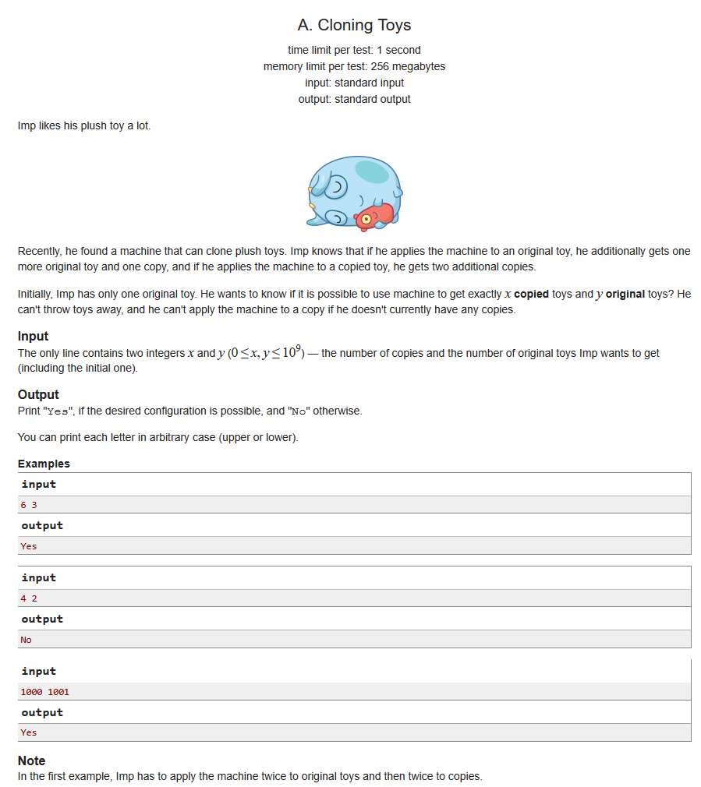

# [克隆的玩具](http://codeforces.com/contest/922/problem/A)

## 描述

lmp 非常喜欢他的毛绒玩具。

最近他发现了一个可以克隆毛绒玩具的机器， lmp 得知如果他用一个玩具的样本去使用这个机器，他会额外得到一个玩具的样本以及一个玩具的复制品。如果他用一个玩具的复制品去使用这个机器，他将会另外获得两个复制品。

最开始， lmp 有且仅有一个玩具的样本。他想知道用这个机器去得到特定的 x 个玩具的复制品以及 y 个玩具的样本是否有可能？他不能把玩具扔掉，并且如果他没有玩具的复制品，那么他就无法使用这个机器得到任何一个复制品。

## 输入

输入仅有一行，包含两个整形数 x 和 y (0 ≤ x, y ≤ 10^9)，这是 lmp 想要得到的玩具的具体数量（包含最初的那一个玩具），其中 x 代表复制品的数量， y 代表样本的数量。

## 输出

如果 lmp 想要的数量合理，就输出“Yes”，否则输出“No”。

你可以不区分大小写。

