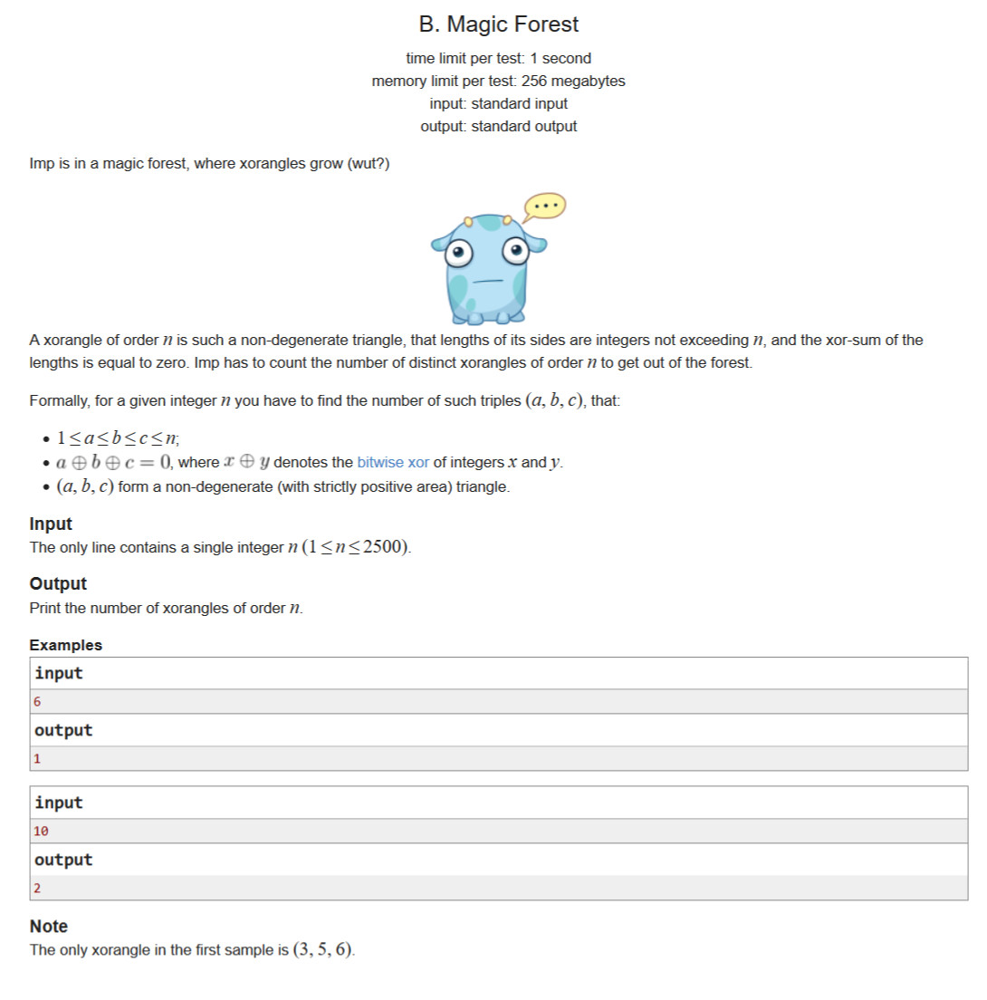

# [魔法森林](http://codeforces.com/contest/922/problem/B)

## 描述

lmp 现在在一个生长“异或三角”的魔法森林中

一个 n 阶“异或三角”是一个三条边长度都是不超过 n 的整数的非退化三角形，并且它的三边长度的异或和等于0。 lmp 为了走出森林，需要计算出那些独特的 n 阶“异或三角”的数量。

形式上，对于一个给定的整数 n ，你需要数出这样的三元组的数目（a，b，c）：

* 1≤a≤b≤c≤n。

* a⊕b⊕c=0, 其中x⊕y代表整数x与y按位异或。

* （a, b, c)是一个非退化三角形的三条边。

## 输入

输入只有一个单独的整数 n （1≤n≤2500）。

## 输出

输出 n 阶“异或三角”的个数。

