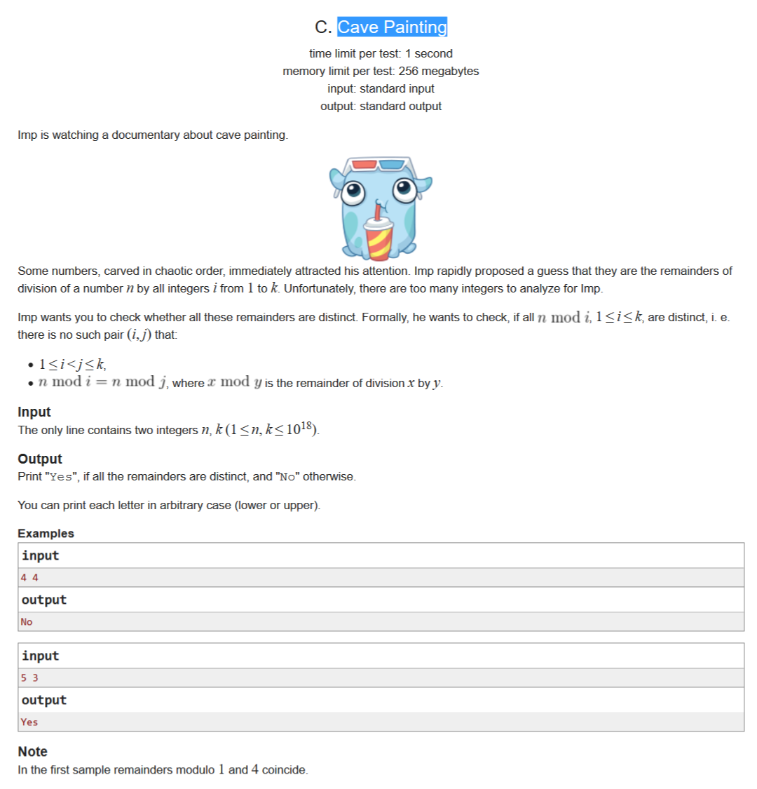

# [洞穴壁画](http://codeforces.com/contest/922/problem/C)

## 描述

lmp 正在看一部有关洞穴壁画的纪录片。

一些以混乱的顺序雕刻的数字，立刻引起了他的注意。 lmp 迅速的提出了一个猜想，即它们是从1到k的所有整数被n除所得到的余数的集合。不幸的是， lmp 需要分析的数据太多以至于他一个人无法独自完成。

lmp 希望你检查所有的余数是否都是不相同的，实际上他是想检查对于1≤i≤k，是否所有的 n 除以 i 的余数都是不同的。例如,不会有一堆数字有以下特征：

* 1≤i＜j≤k

* n mod i = n mod j，x mod y 的值等于 x 除以 y 所得的余数

## 输入

仅包括一行两个整数 n 和 k （1≤n，k≤10^18）。

## 输出

如果所有的余数都是不同的，请输出“Yes”，否则请输出“No”。

输出时你可以不用区分大小写。

## 提示

在第一个例子中，对1和4取余的余数是相同的。

